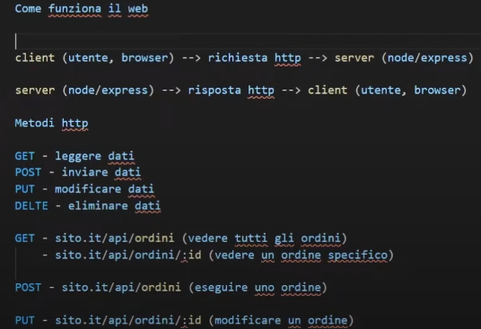
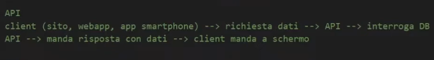

# Appunti introduttivi su NODEJS

## che cosa è NODEJS?
Node.js è un ambiente `di runtime JavaScript costruito sul motore V8 di Chrome`. A differenza dei tradizionali ambienti JavaScript che vengono eseguiti nel browser, `Node.js permette di eseguire JavaScript sul lato server`. È progettato per costruire applicazioni web scalabili e ad alte prestazioni, utilizzando un modello di I/O non bloccante e asincrono.


## per cosa viene usato?
Node.js è utilizzato principalmente per:

01. **Applicazioni web server-side**: È perfetto per costruire server web e API RESTful, grazie alla sua capacità di gestire molte richieste simultanee in modo efficiente (anche se è single-thread, tramite le operazioni asyncrone può metterle da parte mentre sono in pending per essere risolte).

02. **Applicazioni in tempo reale**: È ideale per applicazioni che richiedono comunicazione in tempo reale, come chat, giochi online o sistemi di monitoraggio.

03. **Automazione e script**: Può essere usato per creare script di automazione per operazioni di sistema o attività di back-end.

04. **Microservizi**: Grazie alla sua leggerezza, Node.js è spesso scelto per la creazione di microservizi, che sono facilmente scalabili e gestibili.

05. **Gestione di database NoSQL**: Node.js è ben integrato con database come MongoDB, che spesso vengono utilizzati per applicazioni ad alte prestazioni e con grandi volumi di dati.


## perchè usarlo?

01. **Prestazioni elevate**: Grazie al motore V8 di Chrome e al suo modello asincrono, Node.js può gestire un alto numero di richieste simultanee senza bloccare il flusso di esecuzione, rendendolo molto performante.

02. **Un solo linguaggio**: Con Node.js, puoi utilizzare JavaScript sia per il lato client che per il lato server, semplificando lo sviluppo e migliorando la coesione tra le diverse parti di un'applicazione.

03. **Comunità ampia**: Node.js ha una comunità di sviluppatori molto attiva e un ampio ecosistema di librerie e pacchetti disponibili attraverso il Node Package Manager (NPM), che facilita il lavoro di sviluppo.

04. **Scalabilità**: Node.js è progettato per essere scalabile, sia orizzontalmente (su più macchine) che verticalmente (con più processi su una singola macchina).

05. **Facilità d'uso**: La sintassi di JavaScript è semplice e familiare a molti sviluppatori, rendendo più veloce il processo di apprendimento e l'adozione di Node.js per i team di sviluppo.


---


# Creazione progetto con Node.js

- Vai nella directory in cui vuoi creare il progetto e apri il terminale.
- segui il comando per inizializzare un nuovo progetto con npm:
```bash
npm init -y
```
Questo creerà un file package.json con le impostazioni predefinite.

- Crea un file di entry point, ad esempio index.js, che sarà il file principale da cui parte l'esecuzione del progetto.

## Package.json
Il file package.json è un componente fondamentale di qualsiasi progetto Node.js e ha diverse funzioni chiave. A grandi linee, ecco a cosa serve:

### 01. Gestire le dipendenze**
Il file package.json è un file manifest, in cui vengono descritte tutte le peculiarità del progetto, elenca `tutte le librerie e i pacchetti che il progetto utilizza`.
Questi pacchetti vengono installati tramite npm (Node Package Manager) e vengono registrati nella sezione:
- *"dependencies"*: per le librerie necessarie al funzionamento dell'app, se non installiamo queste dependencies e che non sono nella cartella dei node_modules, non possiamo far partire l'applicazione!.
- *"devDependencies"*: per strumenti di sviluppo come i test, il linting, ecc. quindi non serviranno quando andranno in produzione i nostri progetti con delle dipendenze che servono solo agli sviluppatori (ex: NODEMON, mi serve per vedere i cambiamenti che faccio in REALTIME mentre costruisco l'app)
```json
"dependencies": {
  "express": "^4.17.1"
},
"devDependencies": {
  "nodemon": "^2.0.7"
}
```
### 02. Gestire gli script
Nella sezione `"scripts"`, puoi definire comandi personalizzati per eseguire operazioni comuni nel tuo progetto, come:
- l'avvio del server 
- i test su ambiente di produzione / dev
- la compilazione del codice, ecc.
```json
"scripts": {
  "start": "node index.js",
  "dev": "nodemon index.js"
}
```
### 03. Definire la versione del progetto
La versione del progetto è importante per tener traccia degli aggiornamenti. Puoi seguire il sistema di versionamento semantico (semver), dove la versione è `espressa come major.minor.patch (es. 1.0.0)`.


## Package-lock.json
`package-lock.json` è un file generato automaticamente da npm quando si installano o si aggiornano le dipendenze di un progetto.

### 🎯 A cosa serve?
- 🔒 **Blocca le versioni**: garantisce che tutti gli sviluppatori usino esattamente le stesse versioni delle dipendenze.
- ⚡ **Migliora la velocità**: ottimizza le installazioni future evitando di risolvere nuovamente le versioni dei pacchetti.
- 🔄 **Traccia le dipendenze**: registra l’albero completo delle dipendenze, incluso il loro hash per verificarne l’integrità.

### 🛠️ Quando si aggiorna?
- Quando si installa un nuovo pacchetto (`npm install <package>`).
- Quando si aggiornano le dipendenze (`npm update`).

### ❓ Deve essere committato su Git?
✅ **Sì**, perché assicura che tutti i membri del team abbiano le stesse dipendenze. 🚀


---


# HTTP modules & creazione di un server con NODEJS

## Concetti base di un HTTP server in Node.js
Node.js ha un `modulo integrato chiamato http` che permette di creare un server HTTP senza dipendenze esterne. Il server riceve *richieste (req)*, le elabora e invia una *risposta (res)*.

- **req (request)**: L'oggetto req rappresenta la richiesta HTTP inviata dal client (es. browser, Postman, altro server). Contiene molte informazioni, tra cui:
  - *req.url* → La URL richiesta (es. /home, /api/users).
  - *req.* → Il metodo HTTP usato (es. GET, POST, PUT, DELETE).
  - *req.headers* → Un oggetto con tutti gli header HTTP inviati dal client
  - *req.socket* → Info sulla connessione TCP (IP del client, porta, ecc.).
  - *req.body* → Nei metodi POST o PUT, contiene il corpo della richiesta (bisogna leggerlo con uno stream).

ecco un esempio di cosa si potrebbe vedere al suo interno:
```js
  headers: { host: 'localhost:3000', connection: 'keep-alive' },
  method: 'GET',
  url: '/home',
  socket: <Socket ...>,
  ...
```

- **res (response)**: L'oggetto res rappresenta la risposta HTTP che il server invierà al client. Alcuni metodi utili:
  - *res.writeHead(statusCode, headers)* → Imposta lo status e gli header (es. res.writeHead(200, { 'Content-Type': 'text/html' })).
  - *res.write(data)* → Scrive dati nella risposta (es. res.write('Hello!')).
  - *res.end([data])* → Chiude la risposta e può opzionalmente inviare dati finali.

ecco un esempio di scrittura per creare una risposta da mandare al CLIENT semplice:
```js
res.writeHead(200, { 'Content-Type': 'text/plain' });
res.write('Hello, world!');
res.end();
```


## 01. Creare un HTTP server base
Il modo più semplice per creare un server è usare `http.createServer()` e il metodo `.listen()` per avviarlo su una porta specifica.
SI PUO RESTITUIRE PER OGNI ROTTA GESTITA 1 SOLA RISPOSTA (res.send()||res.json()||res.end()...), SE E + DI UNA LANCERA UN ERRORE!!
un esempio molto comune di come creare un server è:
```js
import http from 'http';

const port = 8000;

// creiamo il server, passando una callback function con req(richiesta) res(response) aggiungiamo del contenuto alla res per poi mandarla
const server = http.createServer((req, res) => {
    res.writeHead(200, { 'Content-Type': 'text/plain' }); // imposta l'header della risposta
    res.write("Hello, World! Il server è attivo."); // invia il corpo della risposta
    res.end(); // chiude la risposta
});

// facciamo partire il server appena creato, mettiamolo in ascolto in una :porta "localhost:PORTA", magari mettendo anche un 2 parametro che viene eseguito quando il server ascoltato e si apre (SI VEDRA SUL TERMINALE!)
server.listen(port, () => {
    console.log(`Server in esecuzione su http://localhost:${port}`);
});
```

per avviare il nostro server lo facciamo tramite comando da terminale: 
```bash
node "nomeFile.js"
```


## 02. HTTP requests
spiegazione semplice di come gira il web tra un CLIENT e SERVER su come comunicano per capire e poi successivamente implementare delle APIs, guardare questa foto: 


---


# Event emitters

## Cos'è EventEmitter?
In Node.js, `EventEmitter` è una classe del modulo `events` che permette di implementare un sistema di eventi personalizzato. 
È utile quando si vuole creare un'architettura **event-driven**, permettendo ai *diversi componenti dell'applicazione di comunicare tra loro senza dipendenze dirette*.

## Quando Usare EventEmitter?
- **Gestione eventi asincroni**
- **Comunicazione tra moduli senza dipendenze dirette**
- **Sistema di logging e notifiche**
- **Server HTTP personalizzati**
- **Gestione di WebSocket e connessioni real-time**

## Importare EventEmitter
Per utilizzare `EventEmitter`, devi prima importarlo dal modulo `events`:
```javascript
const EventEmitter = require('events');
import {EventEmitter} from 'events';
```

## Creare un EventEmitter
Per creare un oggetto che può emettere e ascoltare eventi, bisogna estendere la classe `EventEmitter`:
```javascript
const myEmitter = new EventEmitter();
```

## Emettere e gestire eventi
L'oggetto `myEmitter` può ora:
- **Emettere un evento** con `.emit(evento, ...argomenti)`
- **Ascoltare un evento** con `.on(evento, callback)`
Esempio pratico:
```javascript
/* 
- on(): permette di registrare un listener per un evento specifico. Ogni volta che quell'evento viene emesso, la callback associata viene eseguita.
- emit(): consente di emettere un evento precedentemente registrato con .on(), attivando tutti i listener associati.

Possiamo associare lo stesso `customEmitter` a più eventi, proprio come accade in un'app di messaggistica (es. WhatsApp).  
Ad esempio, un utente potrebbe ricevere sia messaggi privati che di gruppo nello stesso telefono, ma con eventi distinti:
*/
const customEmitter = new EventEmitter(); // gestisce più eventi contemporaneamente

// registriamo gli eventi
customEmitter.on("messaggioPrivato", () => {
    console.log("📩 Messaggio arrivato in privato!");
});
customEmitter.on("messaggioGruppo", () => {
    console.log("👥 Messaggio arrivato nel gruppo amici!");
});

// emettiamo gli eventi
customEmitter.emit('messaggioPrivato', 'messaggioGruppo');
```

## Differenza tra `.on()` e `.once()`
- `.on(event, listener)`: Registra un listener che verrà eseguito **ogni volta** che l'evento viene emesso.
- `.once(event, listener)`: Registra un listener che verrà eseguito **solo la prima volta**.
Esempio:
```javascript
myEmitter.once('welcome', () => {
  console.log('Welcome to the system!');
});
myEmitter.emit('welcome'); // Verrà eseguito
myEmitter.emit('welcome'); // Non verrà eseguito
```

## Rimuovere un Listener
Puoi rimuovere un evento specifico con `.off(event, listener)` o rimuovere tutti i listener con `.removeAllListeners(event)`:
```javascript
const greetListener = (name) => {
  console.log(`Hello again, ${name}!`);
};
myEmitter.on('greet', greetListener);
myEmitter.off('greet', greetListener);
```

## Conclusione
`EventEmitter` è una delle basi del pattern **event-driven** di Node.js ed è fondamentale per creare applicazioni modulari e scalabili. Se vuoi approfondire, puoi consultare la [documentazione ufficiale](https://nodejs.org/api/events.html).


---


# Stream
Le stream in Node.js sono un modo `per gestire dati in modo efficiente senza doverli caricare tutti in memoria contemporaneamente`. Sono particolarmente utili per lavorare con file di grandi dimensioni, dati in rete o processi in tempo reale.

## cosa sono e come funzionano?
Immagina una stream come un fiume di dati che scorre. Invece di aspettare che l'intero fiume arrivi (come fa fs.readFile() caricando tutto in memoria), possiamo prendere piccole parti detti *CHUNCK* di dati alla volta e processarle subito.

Le stream funzionano in `modo asincrono ed event-driven`, il che significa che ascoltano eventi e reagiscono di conseguenza.
**GUARDARE DENTRO 03-stream per spiegazione pratica di come applicare lo stream per FILE MOLTO PESANTI DA LEGGERE**


---


# Express.js 

## 📌 Cos'è Express.js?
Express.js è `un framework per Node.js` che semplifica la creazione di *applicazioni web e **API***. Fornisce un set di funzionalità per gestire le richieste HTTP, middleware e routing.


## Installazione di express
Per installare Express.js nel tuo progetto tramite NPM come dipendenza, esegui:

```sh
npm install express
```


## 🏗️ Creazione di un server base
Usare Express semplifica la creazione di un server, senza andare ad utilizzare moduli come http:
- Il server ascolta sulla porta 8000 come prima.
- Invece di dover gestire manualmente http.createServer, `Express ti offre un metodo app.get()` per gestire facilmente le richieste HTTP GET.
- res.send() è una funzione che invia direttamente la risposta (in questo caso HTML), senza dover usare res.write() e res.end() come con il modulo http.

```javascript
const express = require('express');
const app = express(); // crea un'applicazione Express.
const port = 3000;

// definisce una route che risponde alle richieste GET
app.get('/', (req, res) => {
  res.send('Hello, Express!'); // mandiamo una risposta in markup al posto di .write() / .end()
});

// avvia il server sulla porta specificata.
app.listen(port, () => {
  console.log(`Server in ascolto su http://localhost:${port}`);
});
```


## 🔄 Routing
Express permette di definire + route per gestire diverse richieste HTTP:

```javascript
app.get('/users', (req, res) => {
  res.send('<p>Lista utenti</p>');
});

app.post('/users', (req, res) => {
  res.send('<p>Utente creato</p>');
});
```


## 🗂️ Servire file statici
Per servire file statici come immagini, CSS o JS:

```javascript
app.use(express.static('public')); // serve i file dalla cartella `public/`.
```


## 📡 API REST con Express
Esempio di API per la gestione di un array di oggetti:

```javascript
const users = [{ id: 1, name: 'Alice' }, { id: 2, name: 'Bob' }];

app.get('/api/users', (req, res) => {
  res.json(users); // invia una risposta in formato JSON al client degli utenti.
});
```


## 🔑 Gestione degli errori
Un middleware per gestire errori globalmente:

```javascript
app.use((err, req, res, next) => {
  console.error(err.stack);
  res.status(500).send('Errore interno del server');
});
```

📌 **Spiegazione:**
- Questo middleware intercetta gli errori e risponde con un messaggio.


## 📍 Middleware
I middleware sono funzioni che elaborano le richieste prima di raggiungere il route handler.
Esempio di middleware personalizzato:

```javascript
app.use((req, res, next) => {
  console.log(`Richiesta ricevuta: ${req.method} ${req.url}`);
  next();
});
```

📌 **Spiegazione:**
- `app.use()` registra un middleware globale.
- `next()` passa il controllo al middleware successivo.


## Conclusione riepilogativa
Express.js è un framework potente e leggero per creare API e server web in Node.js. Permette di gestire routing, middleware e richieste HTTP in modo semplice e veloce, ecco i vantaggi principali riassumendo:

- **Semplicità**: Con Express, *creare un server è più semplice*, poiché non devi gestire manualmente le richieste e le risposte, e hai *metodi dedicati* per inviare facilmente risposte.

- **Middleware**: Express supporta i middleware per gestire varie operazioni prima di rispondere alla richiesta (ad esempio, l'autenticazione, la gestione del corpo della richiesta, ecc.).

- **Routing**: Con Express puoi *definire facilmente i percorsi (endpoints)* per vari tipi di *richieste HTTP* (GET, POST, PUT, DELETE, ecc.).

- **Estendibilità**: Express è progettato per essere estensibile e permette di aggiungere facilmente funzionalità aggiuntive tramite librerie e pacchetti npm.


---


# API con expressjs
Le API (Application Programming Interface) in un'applicazione web `consentono la comunicazione` tra il *frontend* (ad esempio, una SPA in JavaScript) e il *backend* (come un server Node.js). 
Le API `espongono degli endpoint (URL)` che il client può chiamare per ottenere o inviare dati.

schema di funzionamento: 
;
```plaintext
 FRONTEND          BACKEND(SERVERSIDE)
(react/vue)  <-------->   api    <------>  DB
```


---


# Query parameters && Query strings

## Query Parameters (Route Parameters)
I **Query Parameters** sono usati per identificare una risorsa in modo più diretto, come ad esempio passare :id di un gruppo di persone.

### Quando usarle
I Query Parameters sono usati quando un valore è parte essenziale dell'endpoint e serve per identificare una risorsa specifica.
✅ Esempi:
1️⃣ Recuperare i dettagli di un utente specifico

### Struttura di un Query Parameter
```plaintext
https://example.com/users/5(:id)
```

### Esempio con Express
```javascript
app.get('/users/:id', (req, res) => {
    const userId = req.params.id; // ottiene l'ID dali parametri della rotta
    res.json({ message: `Dettagli utente con ID ${userId}` });
});
```

📌 **Chiamata GET:**
```plaintext
GET /users/5
```
📌 **Risposta JSON:**
```json
{
  "message": "Dettagli utente con ID 5"
}
```


## Query Strings
Le **Query Strings** vengono utilizzate per passare dati all'interno dell'URL in una richiesta HTTP **GET**, esempio vogliamo andare a prendere il parametro nome della query string, di tutte le persone che hanno quel nome!

### Quando usarle?
Le Query Strings sono usate quando servono filtri, ordinamenti o parametri opzionali per la richiesta.
✅ Esempi:
- `Filtrare o ordinare dati`: Ad esempio, visualizzare prodotti di una certa categoria o ordinare risultati in base a determinati criteri.​
- `Passare parametri opzionali`: Informazioni che non sono essenziali per la visualizzazione della pagina, ma che possono personalizzare l'esperienza dell'utente.​
- `Tracciare informazioni`: Come codici UTM per monitorare le campagne di marketing.​

###  Struttura di una Query String
Un'URL con query string ha questa forma, dove andiamo magari a fare una get di tutti le persone che hanno nome luca, ma MASSIMO mandiamo come risposta solo 2(limite) luca:
```plaintext
https://example.com/persone?nome=luca&limite=2
```
🔹 **Caratteristiche:**
- Inizia con `?` dopo l'URL di base.
- Contiene coppie `chiave=valore`.
- Ogni coppia è separata da `&` se ce ne sono più di una.

### Esempio con Express
```javascript
app.get('/search', (req, res) => {
    const { term, page } = req.query; // estrazione i parametri dalla query string
    res.json({ message: `Hai cercato '${term}' alla pagina ${page}` });
});
```

📌 **Chiamata GET:**
```plaintext
GET /search?term=javascript&page=2
```
📌 **Risposta JSON:**
```json
{
  "message": "Hai cercato 'javascript' alla pagina 2"
}
```


## Combinare Query Strings e Query Parameters
Si possono usare **entrambi** insieme, (numero 5 è :id ed è query parameter  /  quel pezzo dentro il ? è query string):
```plaintext
https://example.com/users/5?details=full
```

### Esempio con Express
```javascript
app.get('/users/:id', (req, res) => {
    const userId = req.params.id;
    const details = req.query.details;
    res.json({ message: `Utente ${userId}, dettagli: ${details}` });
});
```

📌 **Chiamata GET:**
```plaintext
GET /users/5?details=full
```
📌 **Risposta JSON:**
```json
{
  "message": "Utente 5, dettagli: full"
}
```

**Differenze delle Query parameters con Query Strings:**
- Sono parte del percorso dell'URL.
- Non usano `?` e `&`.
- Sono definiti nei percorsi API con `:parametro`.